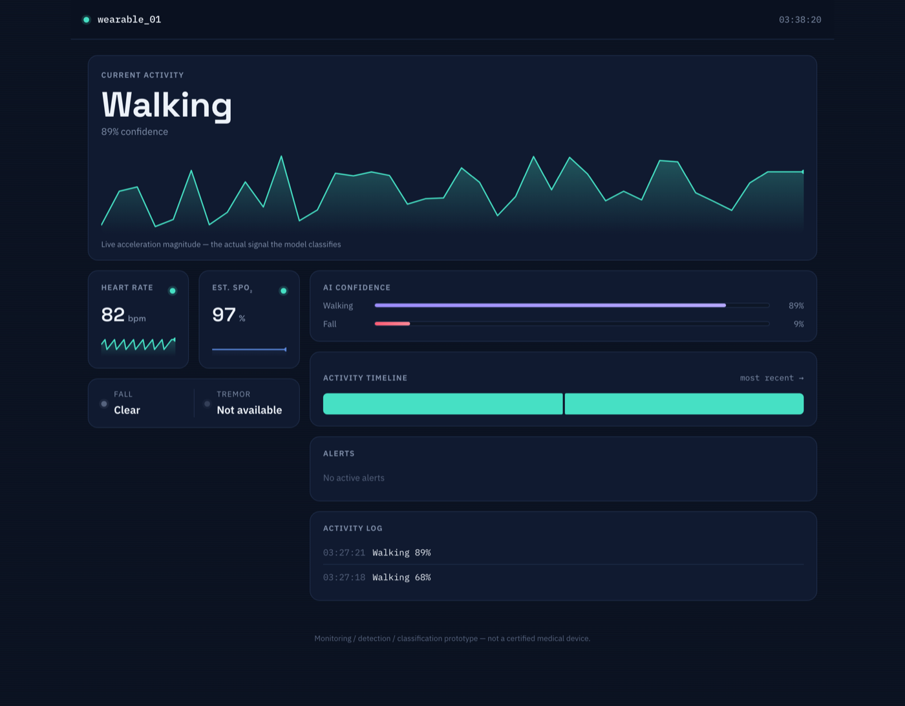
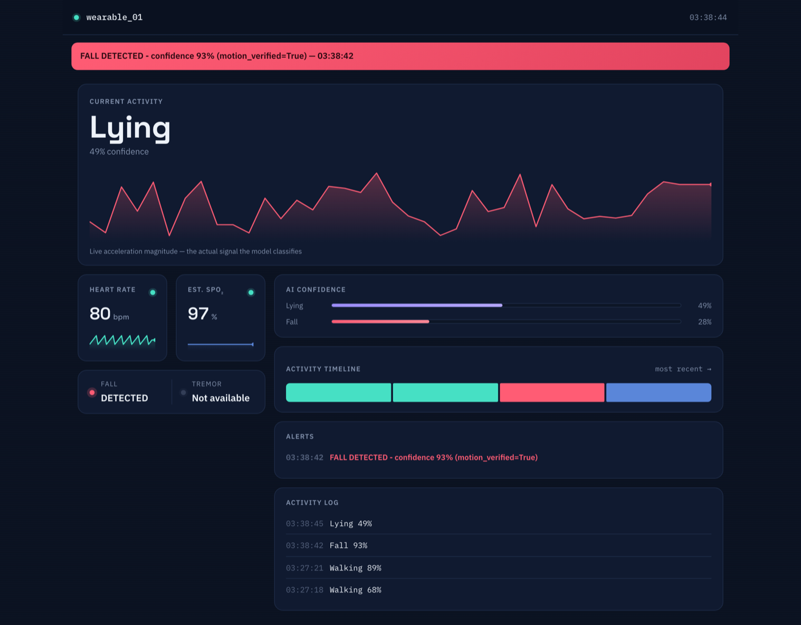
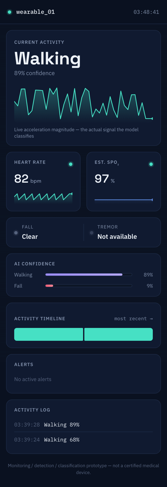

# SmartHealth AI

[](LICENSE)
[](requirements.txt)
[](ml/)
[](backend/)
[](firmware/esp32/)
[](docs/PLAN.md)

Deep learning-based wearable healthcare monitoring system for **Activity, Fall, Tremor, and Vital Sign** monitoring.

> **Academic prototype disclaimer:** This is a 2-person student project for a Healthcare Analytics course. It performs **monitoring / detection / classification** on a low-cost prototype. It is **not** a certified medical device and does **not** diagnose disease, replace clinical judgment, or provide clinically certified vital sign or fall-detection measurements. See [docs/AUDIT.md](docs/AUDIT.md) for the full scope-limits checklist.

## Contents

- [What it does](#what-it-does)
- [Dashboard](#dashboard)
- [Architecture](#architecture)
- [Repository structure](#repository-structure)
- [Tech stack](#tech-stack)
- [Project status](#project-status)
- [Getting started](#getting-started)
- [License](#license)

## What it does

A wearable (ESP32 + MPU6050 + MAX30102) streams motion and physiological data over Wi-Fi to a Flask backend, which segments the IMU stream into sliding windows and runs deep-learning inference (1D CNN, compared against an LSTM) to classify:

- Walking, Standing, Sitting, Running, Lying
- Fall (AI prediction + rule-based verification)
- Tremor-like abnormal movement

Heart rate and estimated SpO₂ from the MAX30102 are captured as a separate, timestamp-synchronized stream. Results are stored in SQLite and shown on a real-time web dashboard, with a local buzzer and dashboard alert on a confirmed fall.

## Dashboard

Mobile-first, config-driven ([`dashboard/static/config.js`](dashboard/static/config.js)) live monitoring UI — the hero waveform is not decorative, it's the actual acceleration-magnitude signal the model classifies, rendered like an instrument readout. Screenshots below are real, taken against the live backend with the actual trained model, not mockups.

<table>
<tr>
<td width="70%" valign="top">

**Desktop, calm state**


**Desktop, confirmed fall alert**


</td>
<td width="30%" valign="top">

**Mobile**


</td>
</tr>
</table>

## Architecture

```
MPU6050 (Ax,Ay,Az,Gx,Gy,Gz)          MAX30102 (HR, SpO2)
        │                                    │
        └───────────────┬────────────────────┘
                     ESP32 (timestamp, JSON)
                         │  Wi-Fi / REST
                         ▼
                  Flask Backend
          (validate → preprocess → sliding
           window 3s@50Hz → 150x6 tensor)
                         │
              ┌──────────┴──────────┐
              ▼                     ▼
           1D CNN                 LSTM
       (primary, deployed)   (comparison model)
              │
      Activity / Fall / Tremor
              │
       Decision Engine (AI + rule verification)
              │
        ┌─────┴─────┐
        ▼           ▼
     SQLite    Alert Logic
                    │
             ┌──────┴──────┐
             ▼             ▼
          Buzzer      Web Dashboard
```

Full technical detail (data flow, model specs, API, DB schema, config) lives in [docs/DOCUMENTATION.md](docs/DOCUMENTATION.md). The baseline architecture is fixed — changes are evaluated against it rather than added casually.

## Repository structure

```
smarthealth-ai/
├── firmware/esp32/       # ESP32 C/C++ firmware (PlatformIO)
│   └── src/               # main.cpp (live streaming), logger_main.cpp (Phase 2 CSV logger)
├── backend/              # Flask API
│   ├── routes/             # sensor ingestion + read endpoints
│   ├── services/            # validation, decision engine, live inference state
│   └── database/            # SQLite schema + access
├── ml/                   # All machine learning code
│   ├── datasets/            # BITS-2 dataset adapter + label mapping
│   ├── preprocessing/       # Shared resampling + normalization (train == inference)
│   ├── segmentation/        # Event-triggered live segmentation
│   ├── cnn/                 # 1D CNN model definition (deployed)
│   ├── lstm/                # LSTM model definition (comparison)
│   ├── training/            # Training + model-selection sweep
│   ├── evaluation/          # Threshold derivation from real data
│   └── inference/           # Real-time inference wrapper
├── dashboard/             # Mobile-first live monitoring UI (vanilla HTML/CSS/JS)
│   └── static/               # config.js, app.js, style.css
├── models/                # Trained model artifacts (gitignored)
├── data/                  # Datasets + SQLite DB (gitignored)
├── tests/                 # Simulated-device sender + end-to-end demo
├── docs/                  # Plan, technical docs, audit checklist, screenshots
├── RUN.md                # Every command to run backend/frontend/models
├── requirements.txt
└── README.md
```

## Tech stack

| Layer          | Choice                                  |
|----------------|------------------------------------------|
| Embedded       | ESP32, PlatformIO, C/C++                 |
| Sensors        | MPU6050 (IMU), MAX30102 (HR/SpO₂)        |
| ML             | Python, NumPy, Pandas, Scikit-learn, PyTorch |
| Backend        | Flask, SQLite                            |
| Dashboard      | Vanilla HTML/CSS/JS, hand-drawn Canvas traces (no chart library) |

## Project status

**Full software stack implemented and tested (2026-08-19).** All 9 phases have code; Phase 3 (ML), 4 (LSTM comparison), 5 (backend), 6 (real-time inference), 7 (dashboard), 8 (decision engine), and 9 (end-to-end, non-hardware scenarios) are verified against real data. Phases 1, 2, and the ESP32 side of Phase 5/8 are **code-complete but hardware-unverified** — firmware compiles cleanly against the real ESP32 toolchain but has never run on a physical board (none available in this environment). See [docs/PLAN.md](docs/PLAN.md) for the per-phase status and [docs/AUDIT.md](docs/AUDIT.md) for the full checklist.

Trained on the [BITS-2 dataset](https://doi.org/10.5281/zenodo.10013090) (same MPU6500+MAX30102 sensor pair as this project's hardware): the deployed 1D CNN reaches **85.1% accuracy / 89.6% fall recall** on a held-out, subject-disjoint test split, beating an LSTM comparison model on every measured axis. `Standing` and `Tremor` are not trained in v1 (no matching data in BITS-2) — see [docs/DOCUMENTATION.md](docs/DOCUMENTATION.md) sec 5/16/21 for the full, honest accounting of what is and isn't covered.

## Getting started

```bash
python -m venv venv
source venv/bin/activate
pip install -r requirements.txt
python -m backend.app   # http://localhost:5000
```

**Full setup, model training, and verification commands (all tested) are in [RUN.md](RUN.md)** — backend, frontend, model training/accuracy, firmware compile-checks, and a one-shot "everything at once" section.

## License

[MIT](LICENSE) — see the LICENSE file for the full text.
